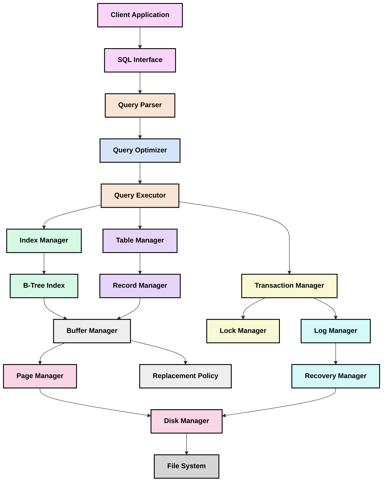

# Database System Architecture

Below is a diagram showing the major components of the database system you'll be building throughout this project. The diagram illustrates how these components interact with each other and the flow of data through the system.

## Component Descriptions

### Lesson 1: Database Fundamentals and Storage Engine
- **Disk Manager**: Handles reading and writing pages to disk
- **Page Manager**: Manages page structure and layout
- **Record Manager**: Handles record storage within pages

### Lesson 2: Buffer Pool Management
- **Buffer Manager**: Caches pages in memory to reduce disk I/O
- **Replacement Policy**: Implements algorithms like LRU for page eviction

### Lesson 3: B-Tree Indexes
- **B-Tree Index**: Implements B-Tree data structure for efficient lookups
- **Index Manager**: Manages creation and maintenance of indexes

### Lesson 4: Table and Record Management
- **Table Manager**: Handles table metadata and schema
- **Record Manager**: Manages record formats and operations

### Lesson 5: Query Processing Basics
- **Query Parser**: Parses SQL into internal representation
- **Query Executor**: Executes query plans

### Lesson 6: Query Optimization
- **Query Optimizer**: Selects efficient execution plans

### Lesson 7: Transaction Management
- **Transaction Manager**: Ensures ACID properties
- **Lock Manager**: Handles concurrency control

### Lesson 8: Recovery System
- **Log Manager**: Manages write-ahead logging
- **Recovery Manager**: Handles crash recovery

### Lesson 9: SQL Interface
- **SQL Interface**: Provides SQL API to clients
- **Client Application**: End-user application

### Lesson 10: System Integration
- **File System**: Underlying OS file system

## Data Flow

1. Client sends SQL query to SQL Interface
2. Query Parser converts SQL to internal representation
3. Query Optimizer selects efficient execution plan
4. Query Executor runs the plan using access methods
5. Access methods retrieve data through Buffer Manager
6. Buffer Manager fetches pages from disk if not in memory
7. Transaction Manager ensures ACID properties
8. Log Manager records changes for recovery
9. Results flow back up to the client

This architecture represents a simplified but complete database system. As you progress through the lessons, you'll build each component and understand how they work together.
